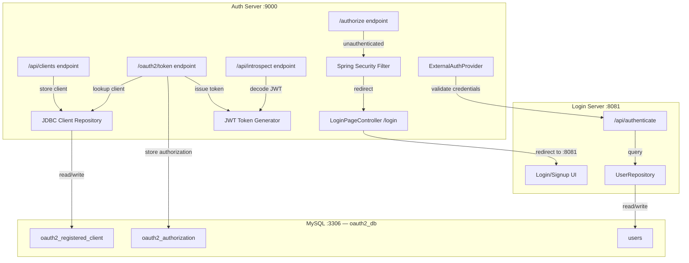
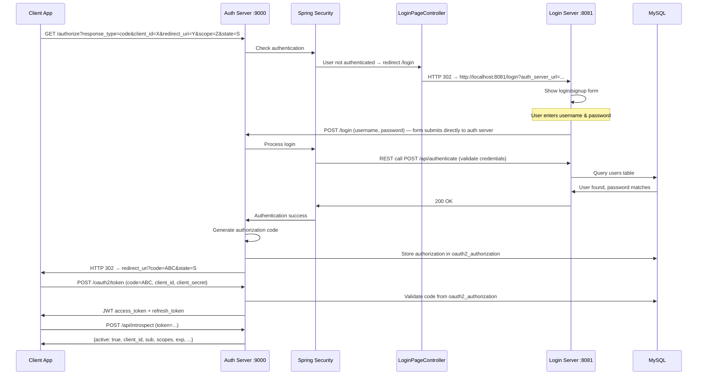
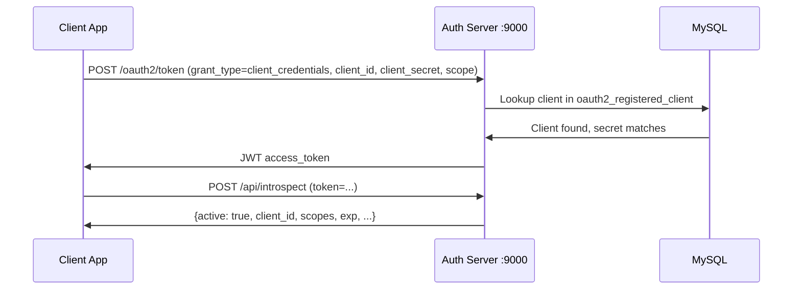
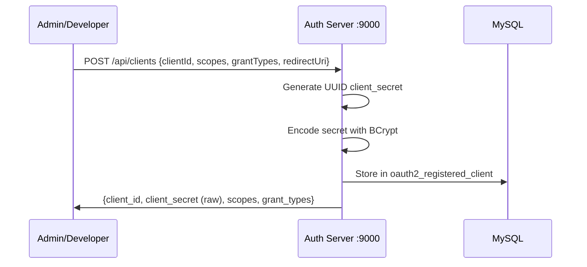

# OAuth 2.0 Server — Architecture & Flow Diagram

## Why LoginPageController exists in Auth Server

The `LoginPageController` in auth-server is **not** a login implementation — it's a **redirect stub**. Here's why it's needed:

Spring Security's form login requires a `/login` URL mapping on the **same server**. When an unauthenticated user hits `/authorize`, Spring Security redirects to `/login` **on port 9000**. The `LoginPageController` **catches that redirect** and immediately forwards to the Login Server at `http://localhost:8081/login`. It contains zero login logic — just one redirect.

```
Spring Security: "User not authenticated → redirect to /login"
          ↓
LoginPageController: "redirect to http://localhost:8081/login"
          ↓
Login Server: "Show the actual login form"
```

Without it, Spring Security would show its own default login form on port 9000, defeating the purpose of a separate login server.

---

## Complete Architecture



---

## Authorization Code Flow (step-by-step)



---

## Client Credentials Flow



---

## Client Registration Flow


